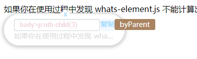

> 定位一个网页DOM元素，一般会以 id,class,name 作为标识符，通过 `document.getElementById()`、`document.getElementByName()` 、 `document.querySelector()` 
原生API来定位获取指定元素。而针对一些无任何标识的节点，如 `<span>文本</sapn>` 是否有方法定位到它们呢？ 

## 使用方法
### 方式一、引入JavaScript文件

demo.html
```javascript
<script src="whatsElement.js"></script>

 var whats = new whatsElement();
  document.addEventListener('mousedown', (event) => {
     const target = event.target;
     const result = whats.getUniqueId(target);//当 getUniqueId()参数为空时候，默认计算鼠标点击到的最后一个HTML元素。
  })
```

### 方式二、npm包引用
安装依赖包
```
npm install whats-element --save
```
demo.js
```javascript
import whatsElement from 'whats-element';
 var whats = new whatsElement();
  document.addEventListener('mousedown', (event) => {
     const target = event.target;
     const result = whats.getUniqueId(target);
  })
```

## 运算结果
```javascript
 result = whatsElement.getUniqueId(target);
```
返回结果 
```javascript
result = {
  uniqueId:"", // uniqueId 为最终的DOM元素在网页中的唯一标识符
  queryType:"" // 结果为：document.getElementById(),document.getElementsByName(),document.querySelector()
}
```


## API
whatsElement 提供以下方法
* *`whatsElement.getTarget(queryString)`*  根据一个标识符获取一个HTML元素对象
* *`whatsElement.getUniqueId(HTMLElement)`*  输入一个HTML对象，计算出它的唯一标识符、定位方式
* *`whatsElement.draw(result)`*  根据 `whatsElement.getUniqueId(HTMLElement)`的结果在页面中渲染出结果信息。



注：`whatsElement.getUniqueId(HTMLElement)`默认自动调用该方法。如果不希望在网页中渲染出结果信息，new 对象时，可如下使用：
```javascript
var compute = new whatsElement({draw:false});//传入参数{draw:false}
var result = comput.getUniqueId(HTMLElement);
```
* *`whatsElement.clean()`*  删除 `whatsElement.draw()` 在网页中绘制的提示框。

## TODO
计算元素属性值，如长宽高、元素位于页面中的绝对位置。